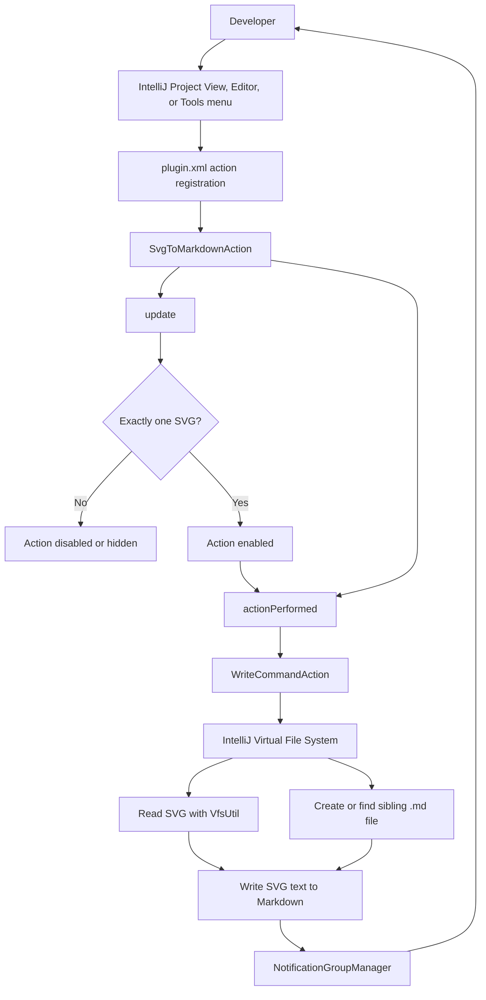
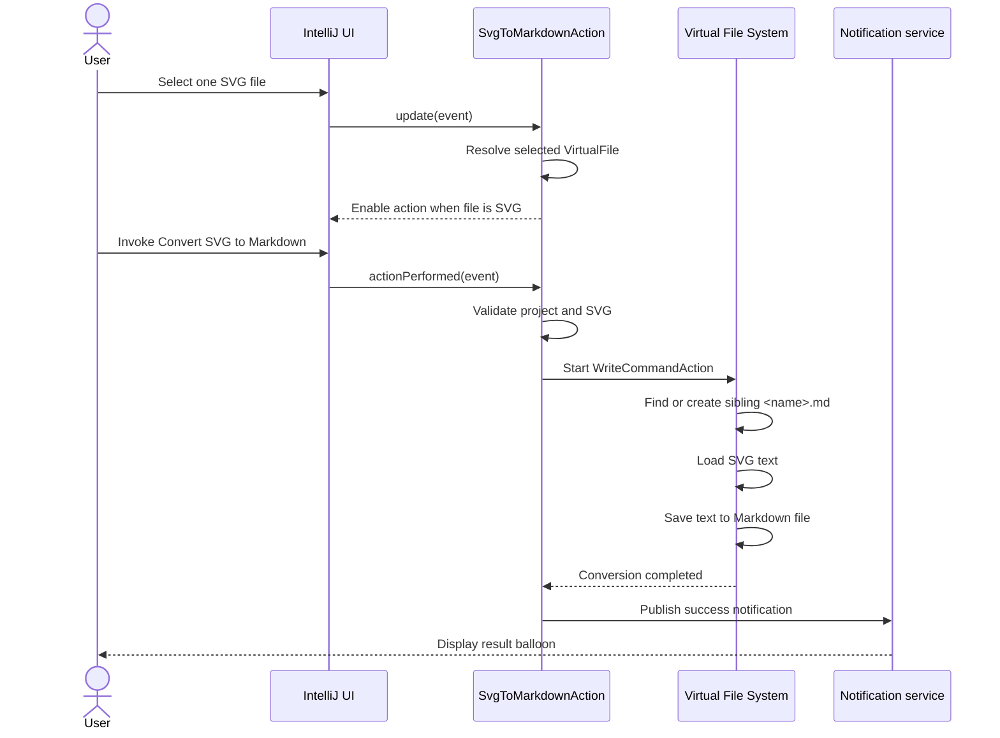

# SVG to Markdown Converter

An IntelliJ IDEA plugin that copies the contents of an SVG file into a Markdown
file in the same directory. It is useful when an SVG diagram needs to be
stored alongside documentation and reviewed as plain text.

## What it does

1. Select one `.svg` file in the Project view or open it in the editor.
2. Choose **Convert SVG to Markdown** from the context menu or **Tools** menu.
3. The plugin creates `<svg-file-name>.md` next to the SVG file.
4. The Markdown file receives the SVG source unchanged. If the Markdown file
   already exists, it is overwritten.
5. An IntelliJ notification reports whether the operation succeeded or failed.

The action is enabled only when exactly one SVG file is selected. Directories,
non-SVG files, multiple selections, and events without a project are ignored.

## Architecture

```text
IntelliJ Project View / Editor / Tools menu
                    |
                    v
        SvgToMarkdownAction.update()
        - reads the selected VirtualFile
        - enables the action for one SVG file
                    |
                    v
      SvgToMarkdownAction.actionPerformed()
        - resolves the selected SVG
        - derives the sibling .md name
        - runs an IntelliJ write command
                    |
                    v
              IntelliJ Virtual File System
        - creates the Markdown file if needed
        - reads SVG text with VfsUtil
        - writes Markdown text with VfsUtil
                    |
                    v
              IntelliJ notification balloon
```

### Main components

- [`SvgToMarkdownAction.java`](src/main/java/com/sc/plugin/SvgToMarkdownAction.java)
  contains the action lifecycle, SVG validation, file conversion, and user
  notifications.
- [`plugin.xml`](src/main/resources/META-INF/plugin.xml) declares the plugin,
  platform dependency, notification group, and menu registrations.
- [`build.gradle`](build.gradle) configures the Java toolchain, IntelliJ
  Platform Gradle plugin, IntelliJ IDEA dependency, and JUnit.
- [`settings.gradle`](settings.gradle) defines the Gradle project name.
- [`gradle/wrapper/gradle-wrapper.properties`](gradle/wrapper/gradle-wrapper.properties)
  pins the Gradle distribution used by the wrapper.
- [`java-memory-mangement.drawio.svg`](java-memory-mangement.drawio.svg) and
  [`java-memory-mangement.drawio.md`](java-memory-mangement.drawio.md) are
- [`sample-image-gallery.svg`](sample/sample-image-gallery.svg) is an image-focused
  gallery with landscapes, gradients, clipping, and captions.
- [`sample-process-diagram.svg`](sample/sample-process-diagram.svg) is a left-to-right
  workflow diagram with connectors, markers, and status cards.
- [`sample-text-poster.svg`](sample/sample-text-poster.svg) is a typography-focused
  poster with headings, quote-like messaging, and a checklist.

The three `sample/sample-*.svg` files are independent examples created
specifically for testing this plugin; they do not reuse the existing Draw.io
SVG.

The plugin uses IntelliJ's `WriteCommandAction` for filesystem changes so the
conversion participates in the IDE's command and undo model. File access uses
the IntelliJ Virtual File System rather than `java.io.File`.

### Architecture diagram



### Sequence flow



## Technology and compatibility

- Java 21 toolchain
- Gradle wrapper using Gradle 9.6
- IntelliJ Platform Gradle Plugin 2.19.0
- IntelliJ IDEA 2025.2.6 during development
- Minimum IDE build declared by the plugin: `252`
- JUnit Jupiter 6.0.0 for tests

## Prerequisites

- JDK 21
- A Git checkout of this repository
- Internet access on the first build so Gradle can download Gradle and
  IntelliJ Platform dependencies

Use the Gradle wrapper from this directory so the documented Gradle version is
used:

```bash
cd custom-plugins/svg-to-md-converter
./gradlew --version
```

On Windows, use `gradlew.bat` instead of `./gradlew`.

## Development

Open `custom-plugins/svg-to-md-converter` as a Gradle project in IntelliJ IDEA.
The IntelliJ Platform Gradle Plugin downloads the configured IDE dependency and
prepares a sandbox IDE for local development.

Run a development IDE with the plugin loaded:

```bash
./gradlew runIde
```

In the sandbox IDE, open or create an SVG file and use **Convert SVG to
Markdown** from the Project view, editor, or **Tools** menu.

When changing the plugin:

- Update the action implementation in `src/main/java`.
- Update action IDs, labels, menu groups, or compatibility in
  `src/main/resources/META-INF/plugin.xml`.
- Keep filesystem writes inside IntelliJ write actions.
- Keep user-visible failures in the existing notification flow.
- Add tests under `src/test` for new conversion behavior when testable without
  starting the IDE.

## Build

Compile the plugin and run the standard verification lifecycle:

```bash
./gradlew clean build
```

Build the installable plugin ZIP directly:

```bash
./gradlew buildPlugin
```

The generated distribution is written to:

```text
build/distributions/svg-to-md-converter-<version>.zip
```

Every `buildPlugin` run also copies the ZIP into the project-level `releases/`
directory:

```text
releases/<version>/svg-to-md-converter-<version>.zip
```

For the current project version, the build artifacts are:

```text
build/distributions/svg-to-md-converter-1.0.0.zip
releases/1.0.0/svg-to-md-converter-1.0.0.zip
```

Useful Gradle tasks:

| Task | Purpose |
| --- | --- |
| `./gradlew clean` | Remove previous build output |
| `./gradlew compileJava` | Compile production Java sources |
| `./gradlew test` | Run JUnit tests |
| `./gradlew build` | Compile, test, and run the standard build lifecycle |
| `./gradlew buildPlugin` | Create the installable plugin ZIP |
| `./gradlew runIde` | Launch a sandbox IDE with the plugin |
| `./gradlew verifyPlugin` | Run IntelliJ Plugin Verifier checks |

## Testing

Run the available automated tests with:

```bash
./gradlew test
```

For a broader pre-release check:

```bash
./gradlew clean build verifyPlugin
```

Also perform a manual smoke test in the sandbox IDE:

1. Select an SVG file.
2. Confirm the action appears in the Project view, editor, and **Tools** menu.
3. Convert it and verify that a sibling `.md` file contains the same SVG
   text.
4. Convert it again and verify that the existing Markdown file is replaced.
5. Select a non-SVG file or multiple files and verify that the action is
   disabled or hidden.

## Installation

### Install a locally built plugin

Install the plugin ZIP into a locally installed IntelliJ IDEA instance:

1. Open a terminal in `custom-plugins/svg-to-md-converter`.
2. Confirm that JDK 21 is available:
   ```bash
   java -version
   ```
3. Build the installable plugin distribution:
   ```bash
   ./gradlew clean buildPlugin
   ```
   On Windows, run `gradlew.bat clean buildPlugin`.
4. Confirm that the ZIP was created under
   `build/distributions/`. For this project, the current file is:
   `build/distributions/svg-to-md-converter-1.0.0.zip`.
5. Start IntelliJ IDEA and open **Settings/Preferences**:
   - macOS: **IntelliJ IDEA | Settings**
   - Windows/Linux: **File | Settings**
6. Select **Plugins** in the sidebar.
7. Open the settings gear menu and choose **Install Plugin from Disk...**.
8. Select the generated `svg-to-md-converter-<version>.zip` file. Do not
   extract the ZIP before installing it.
9. Confirm the installation and restart IntelliJ IDEA when prompted.
10. Open a project containing an SVG file, select it, and verify that
    **Convert SVG to Markdown** is available from the Project view context menu
    or **Tools** menu.
11. Run the action and verify that a same-directory `.md` file is created with
    the SVG source.

To remove the locally installed plugin, open **Settings/Preferences | Plugins**,
find **SVG to Markdown Converter**, open its options menu, choose **Uninstall**,
and restart IntelliJ IDEA.

## Where to find release builds

After running `./gradlew buildPlugin`, the versioned local release ZIP is
available at:

```text
releases/<version>/svg-to-md-converter-<version>.zip
```

For the current version:

```text
releases/1.0.0/svg-to-md-converter-1.0.0.zip
```

You can also browse the repository's published builds and downloadable
artifacts from the [GitHub Releases page](https://github.com/sarabjeetchouhan/tech-library/releases).
Published release ZIPs, when available, should be attached to the matching
GitHub release.

### Install from a published build

No Marketplace publication or release artifact is configured in this project
yet. When a ZIP is attached to a GitHub release, download it from
[Releases](https://github.com/sarabjeetchouhan/tech-library/releases) and
install it using **Install Plugin from Disk...**.

## Build and project links

- [Plugin source directory](https://github.com/sarabjeetchouhan/tech-library/tree/main/custom-plugins/svg-to-md-converter)
- [Build configuration](https://github.com/sarabjeetchouhan/tech-library/blob/main/custom-plugins/svg-to-md-converter/build.gradle)
- [Latest repository Actions runs](https://github.com/sarabjeetchouhan/tech-library/actions)
- [Published releases and downloadable builds](https://github.com/sarabjeetchouhan/tech-library/releases)
- [Gradle wrapper](gradlew)
- [Local build output](build/distributions/)
- [Local release builds](releases/1.0.0/)

The local build output and release links are available after running
`buildPlugin`. The `releases/<version>/` directory contains a copy of each
generated ZIP for convenient local installation or distribution.

## License

This plugin is part of the
[sarabjeetchouhan/tech-library](https://github.com/sarabjeetchouhan/tech-library)
repository. Refer to the repository's license and contribution guidance.
